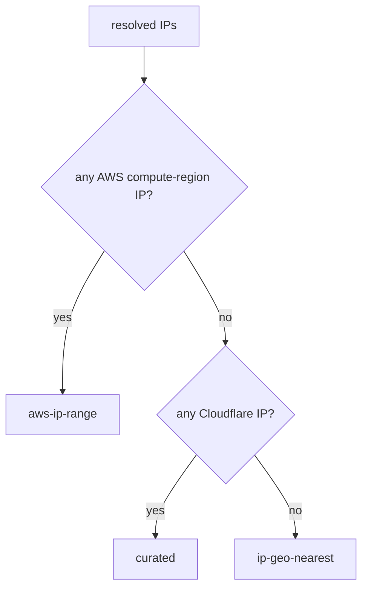

# Colocation Oracle — Method

Exact steps behind every number. All measurement is off-chain; public endpoints
only. Source: `crates/probe`.

## REST latency, p95, success

1. DNS-resolve the host (`api.binance.com`, `api.exchange.coinbase.com`, `api.kraken.com`, …).
2. 1 untimed warm-up GET (amortise TLS), then **N samples** (default 8).
3. Each sample: time the full `GET → read body`; sleep 120 ms; an error/timeout (8 s) is dropped.
4. From successful samples `t[]`:
   - `rest_median_ms = median(t)` (p50)
   - `min_ms = min(t)`
   - `rest_p95_ms = t_sorted[ceil(0.95·n) − 1]`
   - `rest_jitter_ms = stddev(t)`
   - `success_rate = successes / attempts`

## WSS latency

1. DNS-resolve the WSS host (`stream.binance.com`, `ws-feed.exchange.coinbase.com`, `ws.kraken.com`).
2. **N samples** (default 4). Each: open `connect_async`, send the subscribe frame, read frames **skipping ping/pong** until the first `Text`/`Binary`.
3. `ws_latency = connect-start → first data frame`; close. Failures/timeouts (10 s) dropped.
4. `ws_median_ms`, `ws_jitter_ms` = median / stddev of successful samples.

## Per-venue aggregation

- Venue medians = median across that venue's endpoint medians (REST and WSS separately).
- `success_rate` = mean of all endpoint success rates.
- **`stability = success_rate / (1 + cv)`**, where `cv = jitter / median`
  (coefficient of variation). Relative jitter → robust to a venue's absolute
  latency and to one-off spikes. 0 jitter → `stability = success_rate`.

## Region evidence

1. Collect **all** IPs from every REST + WSS url **and** resolve-only hosts
   (`ws-direct.exchange.coinbase.com`, `fix.exchange.coinbase.com:4198`).
2. For each IP, longest-prefix match against AWS `ip-ranges.json`:
   - keep only **compute regions** (drop `GLOBAL`/CloudFront edges);
   - flag Cloudflare IPs via hardcoded CF ranges.
3. Tally IPs per region. `region_evidence` = IPs in the winning region;
   `region_ip_total` = all IPs resolved.

## Method selection (decision order)

- **`aws-ip-range`** (empirical): pick region with most IPs.
  `confidence = min(0.97, 0.75 + 0.20 · region_evidence / region_ip_total)`.
  → Binance `ap-northeast-1`, Coinbase `us-east-1`.
- **`curated`** (CDN-fronted, origin hidden): use documented region at a fixed low
  confidence. → Kraken `eu-west-1` (0.45, Cloudflare); Bybit `ap-southeast-1`
  (0.50, AWS CloudFront); OKX `ap-east-1` (0.50, Cloudflare); Bitfinex
  `ap-northeast-1` (0.35, Cloudflare, region undisclosed — flagged as a guess).
  Both CDNs (Cloudflare *and* AWS CloudFront `GLOBAL`) are treated as edges,
  never geolocated. Gemini, by contrast, exposes real `us-east-1` IPs →
  `aws-ip-range`.
- **`ip-geo-nearest`** (non-AWS, non-CDN): geolocate IP via `ip-api.com`, snap to
  the nearest AWS region by haversine; `confidence = clamp(0.65 − dist_km/4000, 0.30, 0.65)`.

## Latitude / Longitude

- The selected **AWS region code** → its data-center centroid in the static
  `AWS_REGIONS` table (`crates/shared/src/regions.rs`) → that `(lat, lon)` is the
  published point.
- Radius is fixed at **10 000 m** (10 km).
- Stored on-chain as **micro-degrees** (`round(deg × 1e6)`, `i64`).

## Final score & primary pick

- **`score = 0.6 · confidence + 0.4 · stability`** (probe-host RTT is reported,
  not ranked — it's geographic, not colocation latency).
- Primary pick = venue with the highest `score`.
