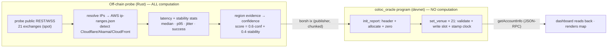

# Colocation Oracle — On-Chain Manual

A concise reference for **what lives on Solana**, and — just as importantly —
**what does not**. All 21 exchanges are now anchored on-chain.

## TL;DR

- **Computed on-chain:** *nothing about the recommendation.* The program is a
  storage + integrity layer. It only validates inputs, stamps the chain clock,
  derives the PDA, and writes bytes.
- **Computed off-chain:** *everything* — probing CEX REST/WSS, DNS resolution,
  AWS IP-range matching, CDN detection, geolocation, latency/stability stats and
  scoring.
- **Published on-chain:** the compact, final recommendation per venue
  (region, lat/lon, radius, confidence, latency, method) for all 21 exchanges.
- **Not on-chain:** stability/jitter/p95/success-rate/score/region-evidence —
  these stay in the off-chain `report.json` and are merged by the dashboard.

This is the classic **oracle pattern**: Solana programs can't make network
calls, so an off-chain probe acts as the oracle and the chain is the
tamper-evident, publicly-verifiable record.

## Coordinates

| Item | Value |
|------|-------|
| Cluster | `devnet` |
| Program ID | `GH9e1ZjDTRo4WKgJYxE1TZHSFFqgXxsDVTB4manBvvh1` |
| Report account (PDA) | `DMr95fEeFLAdy8fGCHpcJEihxcLn5JUWTDwk5F4kxExs` |
| PDA seeds | `["colocation-v2", authority_pubkey]` |
| Account size | 1344 bytes (`[VenueRecord; 21]` + header) |
| Instructions | `init_report`, `set_venue`, `set_colocation` |

## Why writes are chunked

A Solana transaction is capped at **1232 bytes**. A `VenueRecord` is 61 bytes, so
21 of them (~1281 bytes) **cannot** fit in one instruction (only ~14 would). The
report is therefore written in chunks:

1. **`init_report`** — creates/allocates the 1344-byte account, writes the header
   (authority, timestamps, `num_venues`, `primary_index`), and zeroes all slots.
2. **`set_venue(index, record)`** — writes one venue into slot `index`. Called
   once per exchange (21 transactions).

`set_colocation` (single-transaction write) is kept for small reports that do fit.

## What the off-chain side does vs. what the chain does



## What is *published* on-chain

The `ColocationReport` PDA (1344 bytes). Per-venue values are byte-packed;
lat/lon are stored as **micro-degrees** (`degrees × 1e6`) to avoid floats.

| Field | Type | Meaning |
|-------|------|---------|
| `authority` | `Pubkey` | publisher/signer |
| `last_update` | `i64` | **on-chain** clock timestamp of the last write |
| `generated_unix` | `i64` | off-chain probe time |
| `schema_version` | `u32` | layout version |
| `num_venues` / `primary_index` | `u8` | count (21) and index of the best pick |
| `venues[21]` | `VenueRecord` | one per exchange (see below) |
| `bump` | `u8` | PDA bump |

`VenueRecord` (61 bytes):

| Field | Type | Meaning |
|-------|------|---------|
| `exchange` | `[u8;12]` | e.g. `binance` (ids kept ≤ 12 bytes) |
| `region` | `[u8;16]` | e.g. `ap-northeast-1` |
| `lat_micro` / `lon_micro` | `i64` | recommended point (× 1e6) |
| `radius_m` | `u32` | recommended zone radius (10000 = 10 km) |
| `rest_latency_ms` / `ws_latency_ms` | `u32` | measured medians |
| `confidence_bps` | `u16` | region confidence, basis points (0–10000) |
| `method_code` | `u8` | `0`=aws-ip-range, `1`=ip-geo-nearest, `2`=curated |
| `sample_count` | `u16` | total latency samples |

## What is *computed* on-chain (the entire on-chain logic)

```rust
// init_report
require!(num_venues in 1..=MAX_VENUES, InvalidInput);
require!(primary_index < num_venues, InvalidInput);
report.{authority, generated_unix, schema_version, num_venues, primary_index, bump} = ...;
report.last_update = Clock::get()?.unix_timestamp;   // chain clock
report.venues = [zeroed; 21];

// set_venue(index, venue)   — has_one = authority (signer must own the report)
require!(index < report.num_venues, InvalidInput);
report.venues[index] = venue;
report.last_update = Clock::get()?.unix_timestamp;
```

That's all: **input validation, a chain timestamp, PDA derivation, and writes.**
No region inference, no scoring, no latency math runs on-chain.

## What is deliberately *not* on-chain

`stability`, `rest_jitter_ms`, `ws_jitter_ms`, `rest_p95_ms`, `success_rate`,
`score`, `region_evidence`, `region_ip_total`, per-endpoint detail and rationale.
These are larger/volatile telemetry kept in off-chain `report.json`; the dashboard
merges them with the on-chain core at render time (labelled `measured`).

## Verify the on-chain data yourself

- **Explorer — program:**
  <https://explorer.solana.com/address/GH9e1ZjDTRo4WKgJYxE1TZHSFFqgXxsDVTB4manBvvh1?cluster=devnet>
- **Explorer — report account:**
  <https://explorer.solana.com/address/DMr95fEeFLAdy8fGCHpcJEihxcLn5JUWTDwk5F4kxExs?cluster=devnet>

CLI:

```bash
solana account DMr95fEeFLAdy8fGCHpcJEihxcLn5JUWTDwk5F4kxExs --url devnet
solana program show GH9e1ZjDTRo4WKgJYxE1TZHSFFqgXxsDVTB4manBvvh1 --url devnet
```

Raw JSON-RPC (the exact call the dashboard makes):

```bash
curl -s https://api.devnet.solana.com -X POST -H 'content-type: application/json' \
  -d '{"jsonrpc":"2.0","id":1,"method":"getAccountInfo",
       "params":["DMr95fEeFLAdy8fGCHpcJEihxcLn5JUWTDwk5F4kxExs",
                 {"encoding":"base64","commitment":"confirmed"}]}'
```

The returned `data[0]` is base64; drop the first **8 bytes** (Anchor account
discriminator) and borsh-decode the layout above. The dashboard does exactly this
in `crates/dashboard/src/onchain.rs`.
