# Colocation Oracle — On-Chain Manual (iteration 1)

A concise reference for **what lives on Solana** in this first dashboard
iteration, and — just as importantly — **what does not**.

## TL;DR

- **Computed on-chain:** *nothing about the recommendation.* The program is a
  storage + integrity layer. It only validates the payload, stamps the chain
  clock, derives the PDA, and writes bytes.
- **Computed off-chain:** *everything* — probing CEX REST/WSS, DNS resolution,
  AWS IP-range matching, geolocation, latency/stability stats and scoring.
- **Published on-chain:** the compact, final recommendation per venue
  (region, lat/lon, radius, confidence, latency, method).
- **Not on-chain:** stability/jitter/p95/success-rate/score/region-evidence —
  these stay in the off-chain `report.json` and are merged by the dashboard.

This is the classic **oracle pattern**: Solana programs can't make network
calls, so an off-chain probe acts as the oracle and the chain is the
tamper-evident, publicly-verifiable record.

## Coordinates

| Item | Value |
|------|-------|
| Cluster | `devnet` |
| Program ID | `GH9e1ZjDTRo4WKgJYxE1TZHSFFqgXxsDVTB4manBvvh1` |
| Report account (PDA) | `9cxKGbaLaeuU3sa9Z3X2DihSCBwUwwRcnm1t7EqhtbKa` |
| PDA seeds | `["colocation", authority_pubkey]` |
| Instruction | `set_colocation` |

## What the off-chain side does vs. what the chain does

```mermaid
flowchart LR
  subgraph OFFCHAIN["Off-chain probe (Rust) — ALL computation"]
    A["probe public REST/WSS<br/>Binance · Coinbase · Kraken"]
    B["resolve IPs → match AWS ip-ranges.json<br/>detect Cloudflare CDN"]
    C["latency + stability stats<br/>median · p95 · jitter · success"]
    D["region evidence tally → confidence<br/>score = 0.6·conf + 0.4·stability"]
    A --> B --> C --> D
  end
  subgraph ONCHAIN["coloc_oracle program (devnet) — NO computation"]
    E["set_colocation: validate inputs"]
    F["stamp Clock::get() · derive PDA bump"]
    G["write ColocationReport PDA"]
    E --> F --> G
  end
  D -->|"borsh instruction (publisher)"| E
  G -->|"getAccountInfo (JSON-RPC)"| H["dashboard reads back · renders map"]
```



## What is *published* on-chain

The `ColocationReport` PDA (246 bytes). Per-venue values are byte-packed; lat/lon
are stored as **micro-degrees** (`degrees × 1e6`) to avoid floats.

| Field | Type | Meaning |
|-------|------|---------|
| `authority` | `Pubkey` | publisher/signer |
| `last_update` | `i64` | **on-chain** clock timestamp of the write |
| `generated_unix` | `i64` | off-chain probe time |
| `schema_version` | `u32` | layout version (1) |
| `num_venues` / `primary_index` | `u8` | count, and index of the best pick |
| `venues[3]` | `VenueRecord` | one per exchange (see below) |
| `bump` | `u8` | PDA bump |

`VenueRecord`:

| Field | Type | Meaning |
|-------|------|---------|
| `exchange` | `[u8;12]` | e.g. `binance` |
| `region` | `[u8;16]` | e.g. `ap-northeast-1` |
| `lat_micro` / `lon_micro` | `i64` | recommended point (× 1e6) |
| `radius_m` | `u32` | recommended zone radius (10000 = 10 km) |
| `rest_latency_ms` / `ws_latency_ms` | `u32` | measured medians |
| `confidence_bps` | `u16` | region confidence, basis points (0–10000) |
| `method_code` | `u8` | `0`=aws-ip-range, `1`=ip-geo-nearest, `2`=curated |
| `sample_count` | `u16` | total latency samples |

## What is *computed* on-chain (the entire on-chain logic)

```rust
// programs/coloc_oracle/src/lib.rs — set_colocation
require!(!venues.is_empty() && venues.len() <= MAX_VENUES, InvalidInput);
require!((primary_index as usize) < venues.len(), InvalidInput);
report.last_update = Clock::get()?.unix_timestamp;   // chain clock
report.bump        = ctx.bumps.colocation_report;     // PDA bump
report.venues      = <copied from the validated payload>;
```

That's all: **input validation, a chain timestamp, PDA derivation, and a write.**
No region inference, no scoring, no latency math runs on-chain.

## What is deliberately *not* on-chain (iteration 1)

`stability`, `rest_jitter_ms`, `ws_jitter_ms`, `rest_p95_ms`, `success_rate`,
`score`, `region_evidence`, `region_ip_total`, per-endpoint detail and
rationale. These are larger/volatile telemetry kept in off-chain `report.json`;
the dashboard merges them with the on-chain core at render time (clearly labelled
`measured`). A future iteration can extend `VenueRecord` to anchor these too.

## Verify the on-chain data yourself

- **Explorer — program:**
  <https://explorer.solana.com/address/GH9e1ZjDTRo4WKgJYxE1TZHSFFqgXxsDVTB4manBvvh1?cluster=devnet>
- **Explorer — report account:**
  <https://explorer.solana.com/address/9cxKGbaLaeuU3sa9Z3X2DihSCBwUwwRcnm1t7EqhtbKa?cluster=devnet>

CLI:

```bash
solana account 9cxKGbaLaeuU3sa9Z3X2DihSCBwUwwRcnm1t7EqhtbKa --url devnet
solana program show GH9e1ZjDTRo4WKgJYxE1TZHSFFqgXxsDVTB4manBvvh1 --url devnet
```

Raw JSON-RPC (the exact call the dashboard makes):

```bash
curl -s https://api.devnet.solana.com -X POST -H 'content-type: application/json' \
  -d '{"jsonrpc":"2.0","id":1,"method":"getAccountInfo",
       "params":["9cxKGbaLaeuU3sa9Z3X2DihSCBwUwwRcnm1t7EqhtbKa",
                 {"encoding":"base64","commitment":"confirmed"}]}'
```

The returned `data[0]` is base64; drop the first **8 bytes** (Anchor account
discriminator) and borsh-decode the layout above. The dashboard does exactly this
in `crates/dashboard/src/onchain.rs`.
